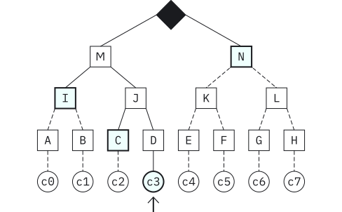

### Merkle Trees

CT logs use a cryptographic mechanism called Merkle trees to make it easier to publicly audit certificates and logs. Merkle trees are simple binary trees, made up of hashed leaves and nodes. **Leaves** are individual certificates that have been appended to the log. **Nodes** are the hashes of paired leaves. The root hash, or Merkle tree hash, is the concatenation of all the nodes and leaves. When the log server signs the **Merkle tree hash**, it’s called a signed tree head (STH).

### Cryptographically checking logs

Monitors and auditors regularly use consistency proofs to verify that logs are behaving properly.

The consistency proof is the minimum set of intermediate node hashes you need to compute that: 

- The old Merkle tree hash **M** is a subset of the **new
  Merkle tree hash.**

- The new **Merkle tree hash** is the concatenation of 
the old Merkle tree hash **M**, plus all the intermediate node hashes of the newly appended 
certificates.

In this example, the consistency proof consists of the following intermediate node hashes: **M**, **K** and **L**. 

Use **K** and **M** to create the old Merkle tree hash. This verifies that the old tree exists and is unchanged. 

You can then use **L** with **K** to create **N**. And then, use **N** with **M** to create the new Merkle tree hash for the log. If this Merkle tree hash matches the one advertised by the log, you have proved that the log is consistent.

A monitor can calculate the consistency proof by itself and verify the consistency of a log, because it typically has the entire list of certificates that are in a log. 

Auditors can simply query a log server and get the consistency proof for any two signed tree heads.

### Showing a certificate is in a log

Anyone can request a Merkle audit proof from a log and verify that a certificate is in the log. If a Merkle audit proof doesn’t produce a root hash that matches the Merkle tree hash, the certificate is not in the log. It’s really important to be able to verify that a specific certificate has been included in a log. CT demands that all TLS clients reject any certificates that do not show up in a certificate log.

Say you want to verify that certificate **c3** (leaf **D**) has been appended to the log. The Merkle audit proof is the missing node hashes that are needed to compute all the nodes between the leaf and tree root. If the root has you compute from the audit path matches the Merkle tree hash for the log, the certificate is in the log.

Here the Merkle audit proof consists of the following node hashes: **C, I, N.** 

- You already know **D**, so you can use **C** to compute **J**. 
- You can then use **I** and **J** to compute **M**, and you can use **N** and **M** to compute the Merkle tree hash for the log.
- If you want to verify that certificate **c4** has been appended to the log, the log would send you a consistency proof with the following node hashes: **F, L, M.** 
- You already know the leaf hash (**E**), which means you can use leaf hash **F** to calculate node hash **K**. 
  You can then use node hash **L** to compute node hash **N**, and you can use node hash **M** and **N** to compute the Merkle tree hash for the log.