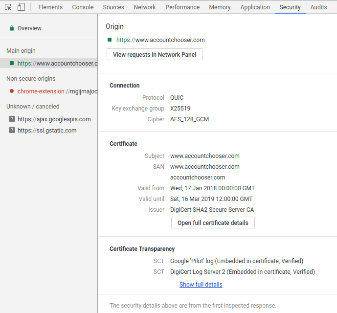

# Table of Contents

 - [Getting Started](#getting-started)
   - [Website](#website)
   - [CA](#ca)
     - [Testing](#testing)
   - [User Agent](#user-agent)
     - [Verifying SCTs](#verifying-scts)
     - [Checking a certificate for inclusion in CT logs](#checking-a-certificate-for-inclusion-in-CT-logs)

# Getting Started

So you want to get on board with Certificate Transparency? The steps you should
take depend on your role. Are you doing so on behalf of a website, certificate
authority (CA) or user agent (e.g. a browser)?

## Website

**Most website operators shouldn't need to do anything** - your CA should have
submitted your HTTPS certificate to a suitable number of CT logs and embedded
SCTs in the certificate before giving it to you. However, if you'd like to check
this for yourself, you can do so using Google Chrome. Open Chrome's developer
tools (under "More tools" in the Chrome menu) and switch to the security tab.
Browse to your website, then click on its URL under "Main origin" (on the left,
in the security tab). This will display security information about your website.
Towards the bottom, there will be a section titled "Certificate Transparency",
which will list the SCTs provided by your website. If this section is not
displayed, then your website did not provide any SCTs and is not compliant with
Certificate Transparency. Otherwise, you can compare the listed SCTs with
Chrome's policy to check whether the provided SCTs are sufficient.

## CA

A certificate authority can generate pre-certificates and submit them to CT logs
in order to embed [SCTs](https://certificate.transparency.dev/howctworks) in
the certificates they provide to their customers. So long as these SCTs are
compliant with the CT policies of browsers (e.g.
[Chrome's policy](https://github.com/chromium/ct-policy/blob/master/ct_policy.md#qualifying-certificate),
their customers should not need to do anything in order to benefit from
Certificate Transparency. The process for generating a pre-certificate is
described in [RFC6962](https://tools.ietf.org/html/rfc6962#section-3.1) and
implemented in most certificate issuance software. There is some value in also
logging the final issued certificate, as it allows CT monitors to see which SCTs
were embedded in it and thereby determine the impact of a CT log being
distrusted by a user agent.

The Chrome team usually insist that any CT log trusted by Chrome is operated in
a fair, open manner. This means they should accept certificates issued by any
root certificate in the major root stores (managed by Microsoft, Apple and
Mozilla) and have reasonable rate limits. Therefore, it should be possible to
immediately begin submitting to most, if not all, of the logs in
[Chrome's log list](https://source.chromium.org/chromium/chromium/src/+/master:components/certificate_transparency/data/log_list.json),
so long as your root certificate is in one of these stores. You can find out
which root certificates are trusted by a CT log by downloading its
[/ct/v1/get-roots](https://tools.ietf.org/html/rfc6962#section-4.7) response.
However, note that it takes around 6 months for updates to Chrome's log list to
reach most of its users, so relying on SCTs from recently-added CT logs may
cause a certificate to only satisfy Chrome's policy in the latest version of
their browser.

### Testing

Many CT log operators run test logs for CAs to perform integration testing
against, e.g. -
[Google's testtube log](certificate.transparency.dev/known-logs) -
[Comodo's Dodo log](https://github.com/Comodo-CA/CTLogs-AcceptedRoots) -
[Let's Encrypt's Testflume log](https://letsencrypt.org/docs/ct-logs/)

These are typically free to use but require that you send them your root
certificate first. They may have additional requirements as well, e.g. that the
root certificate's subject contains the word "test".

## User Agent

There are a few things that a user agent can do to improve security for their
users using Certificate Transparency.

### Verifying SCTs

The simplest thing that a user agent can do is verify that a certificate is
accompanied by a reasonable number of
[SCTs](https://certificate.transparency.dev/howctworks) with valid signatures.
This requires [a list of trusted CT logs] containing their public keys.

### Checking a certificate for inclusion in CT logs

A user agent can confirm that an SCT has been honoured (an SCT is a promise to
include a certificate in a log) by requesting an inclusion proof from the CT log
that issued it. This requires having an STH (signed tree head) from that CT log
that is newer than the SCT by at least that log's MMD (maximum merge delay).
Requesting an inclusion proof may compromise the user's privacy (by revealing to
that CT log that the user visited the website with the corresponding
certificate) so a privacy-preserving method of requesting the proof should be
used. This is an area of active research at Google, as well as in academia.